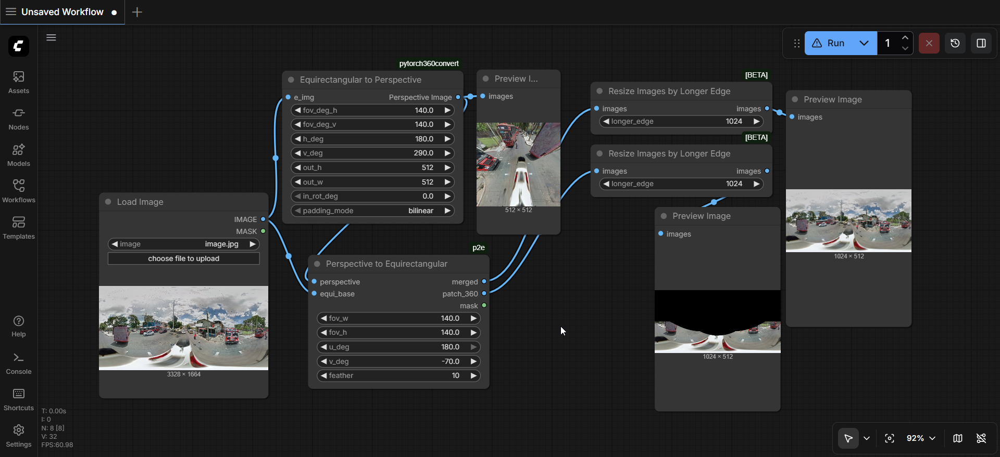

# Perspective to Equirectangular ComfyUI Node

Project a perspective image onto an equirectangular panorama with optional feathered blending.

## Node
Category: `p2e`

**Inputs**
- `perspective` (IMAGE): perspective image to project.
- `equi_base` (IMAGE): target equirectangular panorama.
- `fov_w` (FLOAT): horizontal field of view in degrees, range 1–180 (default 140).
- `fov_h` (FLOAT): vertical field of view in degrees, range 1–180 (default 140).
- `u_deg` (FLOAT): yaw rotation in degrees, range -180–180 (default 180).
- `v_deg` (FLOAT): pitch rotation in degrees, range -90–90 (default -70).
- `feather` (INT): edge blend radius in pixels, range 0–200 (default 10).

**Outputs**
- `merged` (IMAGE): blended panorama.
- `patch_360` (IMAGE): projected patch in equirectangular space.
- `mask` (MASK): blend mask for the projection area.

## Install
1. Copy the `p2e` folder into `ComfyUI/custom_nodes/`.
2. Install dependencies: `pip install -r requirements.txt`.
3. Restart ComfyUI.

## Notes
- Uses cached sampling grids for speed.
- Accepts NumPy arrays or torch tensors (HWC/CHW/BHWC/BCHW) and preserves container type.
